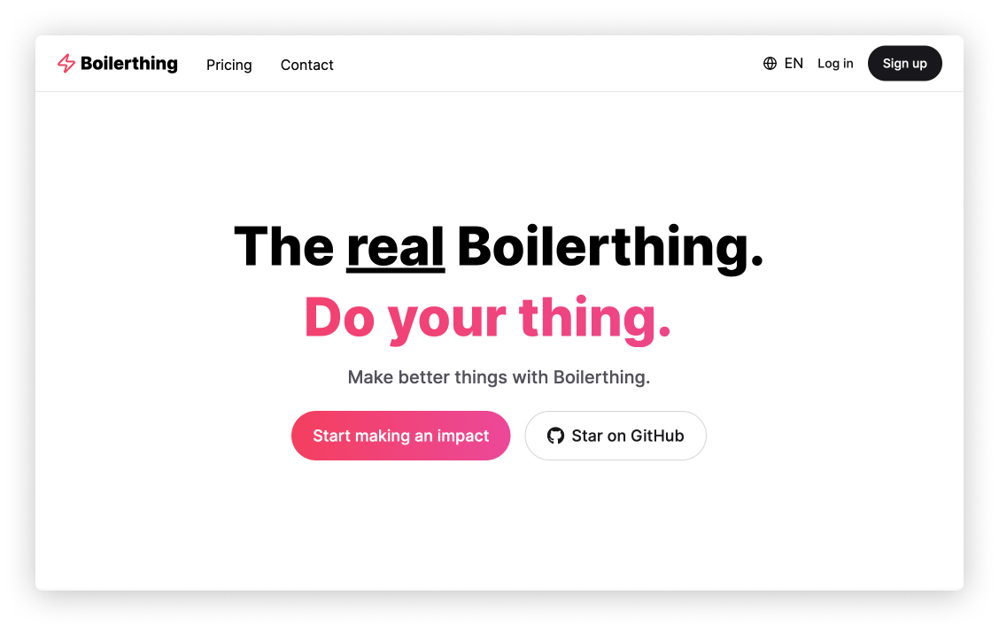

## RRBULL Public website intro

<!-- 

# Boilerthing

Does the world need another Next.js boilerplate? Absolutely! More offerings lead to higher standards and better products. Take a look around and give it a star if you find it valuable! This will make my day 🦄!

## Demo

See it in action: [https://boilerthing.vercel.app](https://boilerthing.vercel.app)

## TL;DR

> Free and open-source **[Next.js 14](https://nextjs.org/)** Boilerplate with (App Router), **[Next-auth (v5)](https://auth.js.org/)**, **[Next-intl](https://next-intl-docs.vercel.app/)** (translated routes), **[Prisma ORM](https://www.prisma.io/)**, **[Resend](https://resend.com/)**, **[Tailwind CSS](https://tailwindcss.com/)**, and **[Shadcn/UI](https://ui.shadcn.com/)** & **[Radix UI](https://www.radix-ui.com/)**, plus many other features.



## Features 🌟

- 🚀 **Next.js** with App Router support
- ⚙️ **Centralized app config** for easy modification
- ✅ **TypeScript** for type checking
- 🔑 **Next-auth v5** for flexible authentication
- 🌐 **Next-intl** for translations (i18n) and translated routes
- 🗄️ **Prisma ORM** for database convenience
- 🐳 **Docker Compose** for easy DB setup
- 🎨 **Tailwind CSS** 3.4
- 📱 **Mobile-first** Design approach
- 🖼️ **ShadCN/UI and Radix** for awesome UI
- 🎓 **Typewriter Effect** for landing page hero section
- 🔐 **T3 Env** for type-safe environment variables
- 📧 **Resend** for email sending
- 📝 **React Hook Form** for form handling
- 🚔 **ReCaptcha** for form security
- 📋 **Zod** for validation
- 🚨 **ESLint** for linting
- 🖌️ **Prettier** for code formatting with import sorting
- 🛡️ **Sentry** for error monitoring
- 🗂️ Absolute imports with `@` prefix

## Development

1. Run `postgres` locally:

   ```bash
   docker run --name boilerthing -p 5432:5432 -d -e POSTGRES_PASSWORD=admin -e POSTGRES_USER=admin -e POSTGRES_DB=boilerthing postgres:latest
   ```

2. Initialize `prisma`:

   ```bash
   npx prisma generate
   npx prisma db push
   ```

3. Populate `.env` based on `.env.example`

4. Run the development server:
   ```bash
   npm run dev
   ```

## Roadmap

Your support means a lot! Give this repo some stars, and I'll speed up the feature development.

Here are some features I'm planning to integrate into Boilerthing:

- 🚧 Test setup with Jest
- 📊 Analytics with Posthog
- 💵 Payments with Stripe
- 🚀 AWS Integration
- 📈 Admin dashboard

## Contributions

I'm open to any suggestions and improvements. Everyone is welcome to contribute to this project! Feel free to open an issue if you have questions or find a bug.

## License

Licensed under the MIT License, Copyright © [Egor Kirpichev](https://github.com/eeegor) 2024

See LICENSE for more information. -->
